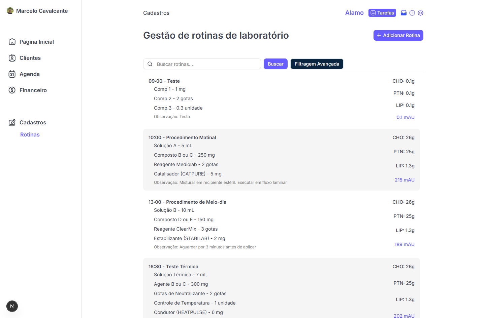

# Laboratory Routine




## Tecnologias

- [Next.js](https://nextjs.org)
- [Tailwind CSS](https://tailwindcss.com)
- [Shadcn UI](https://ui.shadcn.com/)
- [React Query](https://tanstack.com/query/latest)
- [Zustand](https://zustand-demo.pmnd.rs/)
- [React Hook Form](https://react-hook-form.com/)
- [Zod](https://zod.dev/)

## Funcionalidades

- Adicionar uma nova rotina
- Localizar rotinas específicas por nome ou características
- Filtrar resultados por horários
- Ordenar rotinas por horário de execução

## Instalação

### 1. Clonar o repositório

```bash
git clone https://github.com/thiagop90/laboratory-routine.git
```

### 2. Instalar dependências

```bash
npm install
```

### 3. Execute o aplicativo

```bash
npm run dev
```

O aplicativo estará disponível em `http://localhost:3000`.